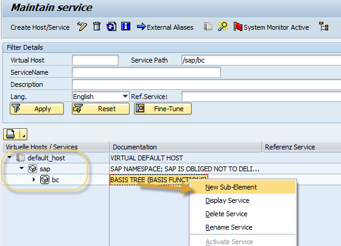
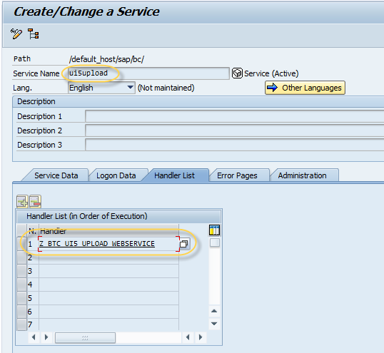

# UI5 Uploader
##Command line app to upload a OpenUI5/SAPUI5 project to a ABAP Repository

## Who will find this tool useful?
* Are you developing a OpenUI5/SAPUI5 application that will be hosted on your SAP Server?
* You want to use a VCS like git or Subversion to collaborate?
* You don't want to use Eclipse but Webstorm or Visual Studio?
* You want to automate the deployment within you continuous integration System? 

So you cannot use the Eclipse "SAPUI5 ABAP Repository Team Provider".

## What is it?
The UI5 Uploader is a command line tool that will upload your UI5 application to the ABAP Repository of your SAP System.
It will do mostly the same job as the /UI5/UI5_REPOSITORY_LOAD-Report but you don't need a SAP GUI 
and you can easily integrate it into your build process or add a button to your favorite IDE.
* Creates the UI5 App in the SAP repository if its not existing. 
* Delta-Upload. Only changed files are added to the transport request.
* Parameters can be configured via config file and command line (command line trumps).
* Single Sign On (if your SAP System supports it).
* Test mode. See what would happen, which filed would be uploaded or deleted.

The tool is a .NET Application written in  C#. It is accessing the SAP system via a webservice. 

## What do you need?
* .NET Framework 4 (should also work with Mono)
* A simple one-class-webservice on your SAP Development system. See Installation for details.

## How to run it?
There tool accepts three commands which can be displayed by runing it without parameters:
```
>UI5Uploader
UI5Uploader - Upload Open/SAPUI5 applications to a SAP ABAP repository
Copyright (c) 2015 Bernhard Klefer, BTC AG. Read license file for details.
Available commands are:
    password    - Set and save the credentials for a SAP system
    upload      - Upload UI5 Application to a SAP Backend
    help <name> - For help with one of the above commands
```

###Examples

```
>UI5Uploader upload -s dev:8000 -src d:\MyUi5App --AppName ZMyUi5App -u bernhard
UI5Uploader - Upload Open/SAPUI5 applications to a SAP ABAP repository
Copyright (c) 2015 Bernhard Klefer, BTC AG. Read license file for details.
[09:35:57] System: http://dev:8000/sap/bc/ui5upload
[09:35:57] Mandant: 100
[09:35:57] Username: bernhard
[09:35:57] Project folder: d:\MyUi5App\
[09:35:57] App name: ZMyUi5App
[09:35:57] Package: $TMP
[09:35:57] Transport: 
Do you want to upload? [Y/N]
y
[09:36:01] Installing App...
[09:36:04] ### Begin of response ##########################
***** Upload der SAPUI5-Anwendung aus ZIP-Archiv in SAPUI5-ABAP-Repository *****
.
* Standardmodus aktiv: Kurzprotokoll *
.
* Verbindung zu ZIP-Archiv mit SAPUI5-Anwendung wird hergestellt *
. http://dev.mydomain.de:8000/sap/bc/webdynpro/sap/ui5upload/5254ED3D79171EE4B
FBF3630FDBBFFFA
80 Dateien in Archiv gefunden.
.
[...]
.
* Bestehende SAPUI5-Anwendung ZMyUi5App wird aktualisiert *
.
* Abgeschlossen *
[09:36:04] ### End of response   ##########################
[09:36:04] Upload successfull!
```

## Installation of the required Webservice 
The webservice consists of a single ABAP class implementing the interface `if_http_extension` 
and a SICF node for which the class is registered as handler. 

**a)**
Import the class and the SICF-Node via 
[SAPlink](http://wiki.scn.sap.com/wiki/display/ABAP/SAPlink+User+Documentation) from the nugget 
[NUGG_Z_BTC_UI5_UPLOAD.nugg](https://github.com/kleferbe/ui5uploader/blob/master/NUGG_Z_BTC_UI5_UPLOAD.nugg)

*or*

**b)** 
You can just copy/paste the code of the class 
[z_btc_ui5_upload_webservice.abap](https://github.com/kleferbe/ui5uploader/blob/master/z_btc_ui5_upload_webservice.abap) 
to your SAP system and create the SICF-Node manually:

1. Start transaction `SICF`.
2. Go to node default_host/sap/bc and choose "New Sub-Element" in its context menu and confirm the next message.

3. Enter `ui5upload` for the "Name of Service Element to Be Created".
4. In the service properties enter at least one Description.
5. Go to tab "Handler List" and add `Z_BTC_UI5_UPLOAD_WEBSERVICE` to the list.
 

:warning: If you create the SICF node with a path differing from `/sap/bc/ui5upload`, 
you have to specify the whole path for the -s parameter. For example `-s http://dev:8001/my/custom/service`